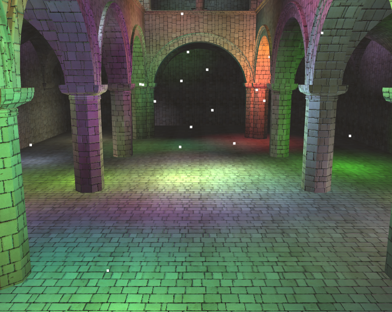
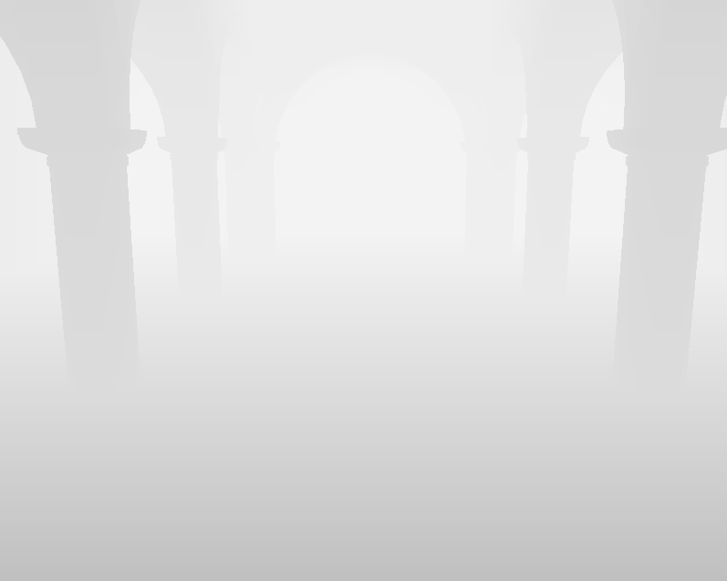
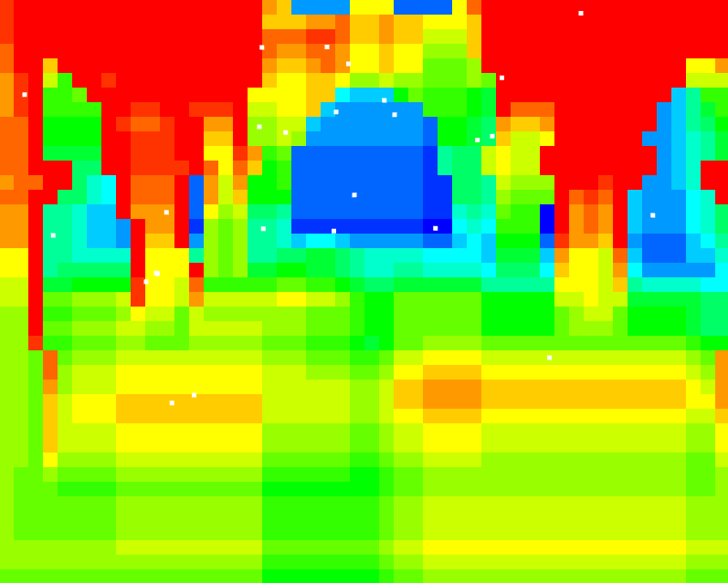
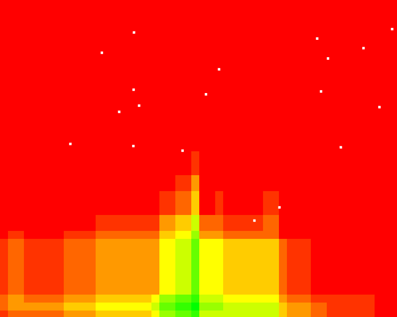

WebGL Tiled Forward Plus Shading
======================

## ScreenShots

## Debug View
|Depth| tile light heat map with depth culling| tile light heat map |
|--------------------------| --------------------|------|
| | | |

*blue-red: 0-20 lights

## Live Demo

[Live Demo Link](http://shrekshao.github.io/WebGL-Tile-Based-Forward-Plus-Renderer/)

## Coarse performance comparison

* num of lights = 120
* light radius = 4.0
* sponza model

| shader | FPS |
|--------|------|
|  forward   |   13   |
|  forward plus   |   21   |
|  forward plus with early z  |   TODO   |
|  forward plus with depth culling  |   17   |
|  deferred  |   5   |
|  deferred with scissor for lights  |   33   |
|  deferred with sphere proxy for lights  |   45   |

*[deferred implementation link used for comparison](https://github.com/shrekshao/Project6-WebGL-Deferred-Shading)

TODO: some details about implementation

## Credits

* [Three.js](https://github.com/mrdoob/three.js) by [@mrdoob](https://github.com/mrdoob) and contributors
* [stats.js](https://github.com/mrdoob/stats.js) by [@mrdoob](https://github.com/mrdoob) and contributors
* [webgl-debug](https://github.com/KhronosGroup/WebGLDeveloperTools) by Khronos Group Inc.
* [glMatrix](https://github.com/toji/gl-matrix) by [@toji](https://github.com/toji) and contributors
* [minimal-gltf-loader](https://github.com/shrekshao/minimal-gltf-loader) by [@shrekshao](https://github.com/shrekshao)